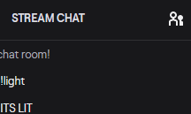

# twitch_arduino_bot

simple project that integrates an arduino with a twitch chatbot. The example produced is the most basic but can be expanded upon for more complex purposes.

## Hardware Setup
### Components:
* Arduino Uno
* Green LED
* 330ohm resistor
* Jumper wires


## Software Setup
### Arduino
1. The arduino controller sketch will be uploaded to the Arduino using the Arduino IDE. 
1. From within the Arduino IDE, select "Tools"->"Port:..." to view and take note of the name of the serial port. For example, it may say "COM3(Arduino Uno)", so the name of the port is "COM3".

### Node.js
This project is dependant on two node.js modules:
* tmi.js (library for the twitch messaging interface)
* serialport (library for serial communication between node.js and Arduino)

To install these libraries, run the commands:

`npm install tmi.js`

`npm install serialport`

Before running the bot.js file, the config.json file must be completed with data. 
```json
{
  "username" : "<BOT_NAME>",
  "password" : "<TWITCH_OATH_PASSWORD>",
  "channels" : [
    "<TWITCH_CHANNEL_NAME>"
  ],
  "portName" : "<ARDUINO_PORT_NAME>"
}
```
Your twitch authorization password can be obtained here: https://twitchapps.com/tmi/

More info: https://dev.twitch.tv/docs/irc

## Running the bot program
Navigate to the twitch_arduino_bot/js directory and execute the command:
`node bot.js`

A successful connection and port opening will log:


Once connected and running, the !light command can be entered into the channel's twitch chat:


